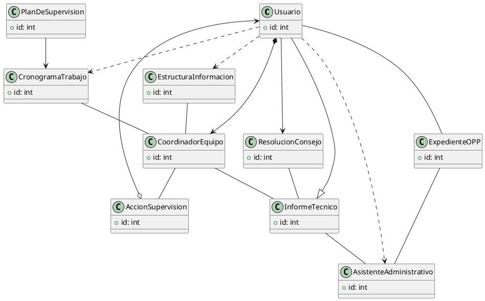

```plantuml

@startuml
class Usuario {
  +id: int
}

class PlanDeSupervision {
  +id: int
}

class CronogramaTrabajo {
  +id: int
}

class EstructuraInformacion {
  +id: int
}

class CoordinadorEquipo {
  +id: int
}

class AccionSupervision {
  +id: int
}

class InformeTecnico {
  +id: int
}

class ResolucionConsejo {
  +id: int
}

class AsistenteAdministrativo {
  +id: int
}

class ExpedienteOPP {
  +id: int
}

Usuario ..> CronogramaTrabajo
Usuario ..> EstructuraInformacion
Usuario *--> CoordinadorEquipo
Usuario <--o AccionSupervision
Usuario --|> InformeTecnico
Usuario --> ResolucionConsejo
Usuario ..> AsistenteAdministrativo
Usuario -- ExpedienteOPP

PlanDeSupervision -->  CronogramaTrabajo
CronogramaTrabajo -- CoordinadorEquipo
EstructuraInformacion -- CoordinadorEquipo
CoordinadorEquipo -- AccionSupervision
CoordinadorEquipo -- InformeTecnico
ResolucionConsejo -- InformeTecnico
InformeTecnico -- AsistenteAdministrativo
ExpedienteOPP -- AsistenteAdministrativo
@enduml
```